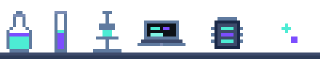
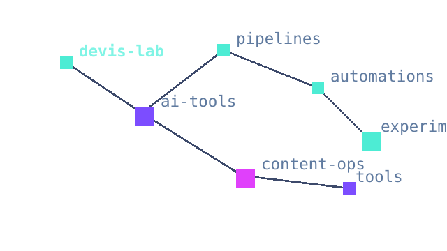
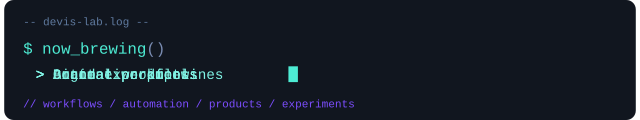

# Devis Lab

  <a href="https://devis-lab.pages.dev/brand-lab">
    <picture>
      <source media="(prefers-color-scheme: dark)" srcset="https://devis-lab.pages.dev/brand/github-banner-pixel-blue-dark.png">
      <source media="(prefers-color-scheme: light)" srcset="https://devis-lab.pages.dev/brand/github-banner-pixel-blue-light.png">
      
    </picture>
  </a>

  <strong>Small lab. Big projects. Clear signal.</strong> 
  Building digital products, automations and AI-powered tools.

  <a href="https://devis-lab.pages.dev/brand-lab">
    <picture>
      <source media="(prefers-color-scheme: dark)" srcset="assets/elixir-dark.svg">
      <source media="(prefers-color-scheme: light)" srcset="assets/elixir-light.svg">
      
    </picture>
  </a>

  <a href="https://devis-lab.pages.dev/brand-lab"><strong>Take me to the Lab -></strong></a>

  <code>// lab.equipment()</code>

  <picture>
    <source media="(prefers-color-scheme: dark)" srcset="assets/equipment-shelf-dark.svg">
    <source media="(prefers-color-scheme: light)" srcset="assets/equipment-shelf-light.svg">
    
  </picture>

  <code>// lab.projects()</code>

  <picture>
    <source media="(prefers-color-scheme: dark)" srcset="assets/projects-constellation-dark.svg">
    <source media="(prefers-color-scheme: light)" srcset="assets/projects-constellation-light.svg">
    
  </picture>

  <code>// lab.brewing.now()</code>

  <picture>
    <source media="(prefers-color-scheme: dark)" srcset="assets/brewing-now-dark.svg">
    <source media="(prefers-color-scheme: light)" srcset="assets/brewing-now-light.svg">
    
  </picture>

---

  
    Copyright © 2026 Devis Lab. All rights reserved. 
    This repository is shared publicly for portfolio and reference purposes only. No license is granted to use, copy, modify, distribute, or reuse the source code, design system, logo, name, brand assets, visual identity, animations, or README components without explicit written permission.
  

